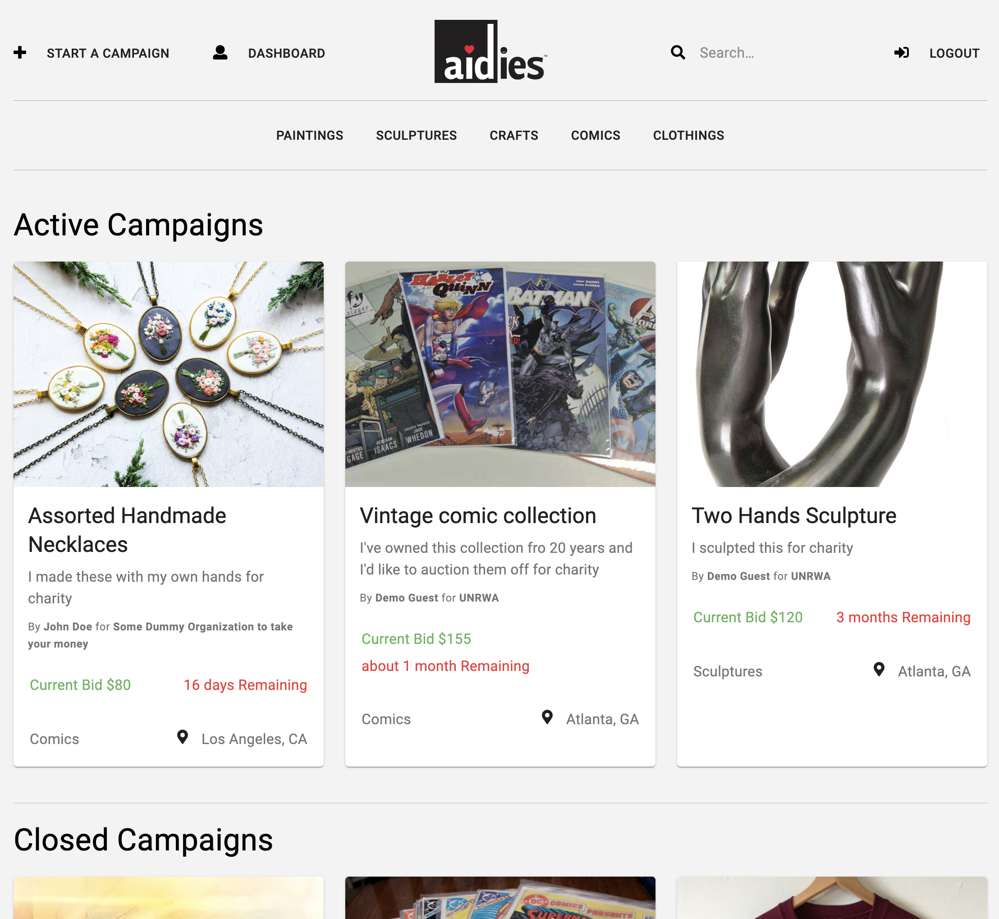

# Aidies
*By Ammar Nassri - [Visit Aidies](https://aidies.herokuapp.com/)*

## Table of Contents:
* [Aidies Summary](#aidies-summary)
* [Technologies Used](#technologies-used)
* [Frontend Overview](#frontend-overview)
* [Backend Overview](#backend-overview)
* [Next Steps](#next-steps)

## Aidies Summary
Aidies is an auction app modeled after Kickstarter. Its objective is to help you auction off your work for charity. Aidies makes it easy to support the charity you love by selling a piece of work you made. 


## Technologies Used
Aidies is a full-stack application built with a React frontend and an Express backend. Most of the logic happens in the React frontend. Incorporating [Material UI framework](https://material-ui.com/) for the styling.

The frontend is served by the backend, which responds to requests, and grabs data from the PostgreSQL database.

## Frontend Overview

Aidies is a frontend heavy application. It utilizes React to create a dynamic and rich user experience. Here are the technologies used to make this application.

### React

Aidies is a React application. It utilizes its higher order components for a dynamic and efficient rendering. The app extensively uses the technologies and libraries of the React ecosystem.


In the main page that displays all campaigns, the app generates the campaign cards dynamically. The code snippet below renders cards.

```js
<Grid   container 
        direction="row"
        justify="center"
        spacing={3}>
        {campaigns.length
        ? campaigns.map((campaign) => { if(!campaign.isExpired) return <Grid key={campaign.id} item xs={4}>
                <CampaignItems  campaign={campaign} /></Grid> })
        : <h1 className="no-campaigns-container">No Active Campaigns Found.</h1>
        }
</Grid>
```

The code above utilizes the `CampaignItems` component to dynamically generate those cards. Here's what the `CampaignItems` looks like under the hood:

```js
<Card className={`${classes.root} card-container`}>
    <CardActionArea>
        <Link key={campaign.id} to={`/campaign/${campaign.id}`} className={classes.text}>
            <CardMedia
                className={classes.media}
                image={campaign.image}
                title={campaign.name}
            />
        <CardContent>
        
            <Typography gutterBottom variant="h5" component="h2" >
                {campaign.name}
            </Typography>
            <Typography variant="body1" color="textSecondary" component="p">
                {campaign.summary}
            </Typography>
            <Typography variant="caption" color="textSecondary" component="p" style={{marginTop: 10}}>
                By <span style={{ fontWeight: "bold" }}>{campaign.User.firstName} {campaign.User.lastName}</span> for <span style={{ fontWeight: "bold" }}>{campaign.Charity.name}</span>
            </Typography>
        </CardContent>
        <CardActions className="stats-container">
            <div className="bid time-left">
                <div className="current-bid">
                    <Typography gutterBottom variant="body1" component="h2">
                        <DetermineBid campaign={campaign} />
                    </Typography>
                </div>
                <div className="remaining counter progress-bar">
                    <Typography gutterBottom variant="body1" component="h2">
                        <DetermineTimeRemaining isExpired={campaign.isExpired} closingDate={campaign.closingDate} createdAt={campaign.createdAt} />
                    </Typography>
                    <div className={classes.progress}>
                        <LinearProgress variant="determinate" value={progress} />
                    </div>
                </div>
            </div>
        </CardActions>
        <CardActions className="items-other-info-container">
            <div className={`${classes.bottom} items-other-info`}>
                <Typography variant="body1" color="textSecondary" component="p">
                    {campaign.Category.name}
                </Typography>
                <div className="location">
                    <div className="nav-icon"><i className="fas fa-map-marker-alt"></i></div>
                    <Typography variant="body1" color="textSecondary" component="p">
                        {campaign.User.location}
                    </Typography>
                </div>
            </div>
        </CardActions>
        </Link>
    </CardActionArea>

</Card>
```
`PostCard` will destructure the props to use the information contained and insert them where they need to be in the layout. It also determines wether certain actions have already been taken on the post itself, such as likes and comments, and displays those accordingly. If the logged in user has clicked the `Like` button before, it will register that as such.

The comment and like actions are performed and displayed through local state to prevent performing an extra fetch request to reload the state. Instead the global state is updated the next time the user visits the same page. This won't interrupt the user's experience and displays the information accurately. In addition, it allows for a smoother and quicker experience. 


### Redux

[Redux](https://redux.js.org/) and the [react-redux](https://react-redux.js.org/) were used to manage the application's state and make fetch requests to the backend.

After authentication, posts' information related to user's friends are fetched and kept in the Redux store. This is probably the most expensive operation the application does, and while it might lengthens the initial load time, it provides a smoother experience once that load is complete.

Redux also stores information about friends, notifications, searches, and posts belonging to a certain user. These are stored when a user navigates to the corresponding page. 

Redux paves the way for new features to be integrated easily.

### CSS & Material UI

Aidies was meant to ditch all CSS frameworks such as Material UI and rely completely on raw CSS. This allowed extensive customization and the ability to pixel match the app to the original mockups created during the planning stage.

However, the decision to incorporate a few Material UI components was to save time and spend it on functionalities that are more important. These components are limited to modals, and/or buttons with more sophisticated hover effects.

#### Original Mockup


#### End Result



### Responsive Design
Aidies is built with responsiveness in mind. The app can be used both in a browser and on mobile phones.

#### Mobile view


### Location IQ

The [Location IQ API](https://locationiq.com/) is a nice added feature that helps give location suggestions in case the user wants to add a location to a post. A drop down is displayed with different locations based on the the characaters typed in.

### Date-fns
The [Date-fns](https://date-fns.org/) library is used to make time easier to read with words instead of the datetime format JavaScript provides.

## Backend Overview
Aidies uses a Python/Flask server with PostgreSQL as the database. The backend is fairly simple in comparison to the frontend. It sends the frontend to the client, receives requests and sends data to the frontend. Here is a breakdown of the backend technologies.

### Flask
[Flask](https://flask.palletsprojects.com/en/1.1.x/) was chosen as Aidies's server-side framework for its minimalism. Flask makes it easier to integrate technologies such as [CSRF protection](https://owasp.org/www-community/attacks/csrf) without extra configuration. In addition, Flask integrates with SQLAlchemy, which makes querying data much simpler and more efficient.

### PostgreSQL
[PostgreSQL](https://www.postgresql.org/) is used as the project's database. Its simplicity and flexibility makes it an obvious choice amongst other SQL databases. However several challenges arose from using a SQL database which warrants the use of [NoSQL](https://aws.amazon.com/nosql/) databases instead. See [Next Steps](#next-steps) section for more informaiton about that.

### AWS S3

Aidies allows users to upload photos to their posts and update their profile and cover photos. For that, [S3](https://aws.amazon.com/s3/) was utilized for cloud storage. The flask server receives the photo file, generates a random name for it and uploads it to S3. 

S3 code flow
```python
def upload_file_to_s3(file, acl="public-read"):
    ext = file.filename.split('.')[1]
    new_file_name = get_random_name(20) + '.' + ext
    try:
        s3.upload_fileobj(
            file,
            bucket,
            new_file_name,
            ExtraArgs={
                "ACL": acl,
                "ContentType": file.content_type
            }
        )
    except Exception as e:
        # Catch all exceptions
        print("Something Happened: ", e)
        return e
    
    photoUrl = "{}{}".format(
        'https://Aidies.s3.us-east-2.amazonaws.com/',       new_file_name)
    return photoUrl
```

## Next Steps
Aidies is a living app. It will always have new features added to it to continue to improve it for best user experience.

### Challenges
One challenge came while working with Flask and SQLAlchemy, is the fact that queries need to be converted into dictionaries in order to be in a JSON format that the frontend can understand. This has the potential of being inefficent very quickly as the app gets more users and subsequently more posts.

A code snippet of the problem
```python
# grab all posts of friends of the user and user's post and all their relatationships
@post_routes.route('/<int:id>', methods=['GET'])
@jwt_required
def find_all_posts(id):
    relationships = Relationship.query \
                        .filter(or_(Relationship.user_id==id, Relationship.friend_id==id)) \
                        .filter(Relationship.status==2) \
                        .all()
    user_posts = Post.query \
                .filter(Post.user_id==id) \
                .all()
    
    data=[]
    def grab_data(post):
        comments = []
        likes = []
        tagged_people = []
        for comment in post.comments:
            comm = {**comment.to_dict(), "owner": comment.owner.to_dict()}
            comments.append(comm)
        for like in post.likes:
            lik = like.to_dict()
            likes.append(lik)
        for friend in post.tagged_friends:
            person = friend.users.to_dict()
            tagged_people.append(person)
        location = None
        photo = None
        if post.location:
            location = post.location.to_dict()
        if post.photos:
            photo = post.photos[0].to_dict()
        dic = {**post.to_dict(),
            "comments": comments,
            "type": post.type.to_dict(),
            "owner": post.owner.to_dict(),
            "likes": likes,
            "photo": photo,
            "location": location,
            "taggedFriends": tagged_people}
        data.append(dic)
    # convert query results to dictionaries
    for relationship in relationships:
        for post in relationship.friends.posts:
            if not post.user_id == id:
                grab_data(post)
        for post in relationship.person.posts:
            if not post.user_id == id:
                grab_data(post)
    for post in user_posts:
        grab_data(post)

            
        
    return jsonify(data=data)

```
The solution for this rather complex issue, is the switch to a NoSQL database. With a non-relational database, that issue is eliminated. Since the database saves the data in a collection of JSON-like records, there would be no need to convert a query result to a dictionary, hence reducing the complexity signifcantly. This allows for a much faster load since the backend doesn't have to loop through a ton of records before sending the data to the front end.

### Additional Features
A few features that are in the works:
* Implement a NoSQL Database. GraphQL and MongoDB.
* Circles, the ability to filter friends into groups gives extra privacy in case the user wishes to have her/his posts visible to a particular group of people and not the others.
* Chat, a feature allowing users to text, call and video chat between them and their friends.

### Conclusion
Aidies is my second solo project and the first one with a Flask backend. I've had a lot fun building it and I've learned a lot during the process. 

I've always enjoyed being on social media, reading what everyone is up to and catch up with news. As time passed, social media has become more about news, photos, stories and how-to content than about people you care about. News of loved ones get buried in a sea of irrelevant content.

I have family and friends who have migrated all over the world and it was getting more difficult to keep in touch with them. It was crucial to me to build something that helps solve that problem and facilitates a way to communicate without the extra content.
