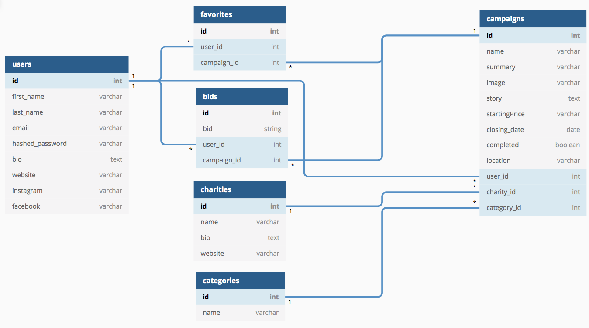

## users

| Column Name           | Data Type       | Details                     |
| -----------           | -----------     | -----------                 |
| `id`                  | int             | not null, primary key       |
| `firstName`           | string          | not null, indexed   |
| `lastName`            | string          | not null, indexed   |
| `email`               | string          | not null, indexed, unique   |
| `hashedPassword`      | string          | not null                    |
| `bio`                 | text            | not null                    |
| `website`             | string          |                             |
| `instagram`           | string          |                             |
| `facebook`            | string          |                             |
| `createdAt`           | datetime        | not null                    |
| `updatedAt`           | datetime        | not null                    |  

## campaigns

| Column Name       | Data Type       | Details                 |
| -----------       | -----------     | -----------             |
| `id`              | int             | not null, primary key       |
| `name`            | string          | not null, indexed, unique   |
| `summary`         | string          | not null, indexed           |
| `image`           | string          | not null, indexed, unique   |
| `story`           | text            | not null                    |
| `startingPrice`   | string          | not null                    |
| `closingDate`     | datetime        | not null                    |
| `completed`       | boolean         | not null, default: false    |
| `location`        | string          | not null                    |
| `userId`          | int             | not null, indexed, unique, foreign key                            |
| `charityId`       | int             | not null, indexed, unique, foreign key                    |
| `categoryId`      | int             | not null, indexed, unique, foreign key                    |
| `createdAt`       | datetime        | not null                    |
| `updatedAt`       | datetime        | not null                    |

* `userId` references `users`
* `charityId` references `charities`
* `categoryId` references `categories`

## charities

| Column Name       | Data Type       | Details                     |
| -----------       | -----------     | -----------                 |
| `id`              | int             | not null, primary key       |
| `name`            | string          | not null, indexed, unique   |
| `bio`             | text            | not null                    |
| `website`         | string          | not null                    |
| `createdAt`       | datetime        | not null                    |
| `updatedAt`       | datetime        | not null                    |

## categories

| Column Name       | Data Type       | Details                     |
| -----------       | -----------     | -----------                 |
| `id`              | int             | not null, primary key       |
| `name`            | string          | not null, indexed, unique   |
| `createdAt`       | datetime        | not null                    |
| `updatedAt`       | datetime        | not null                    |

## favorites

| Column Name       | Data Type       | Details                     |
| -----------       | -----------     | -----------                 |
| `id`              | int             | not null, primary key       |
| `userId`          | int             | not null, indexed, unique, foreign key                            |
| `campaignId`         | int             | not null, indexed, unique, foreign key                            |
| `createdAt`       | datetime        | not null                    |
| `updatedAt`       | datetime        | not null                    |

* `userId` references `users`
* `campaignId` references `campaigns`

## bids

| Column Name       | Data Type       | Details                     |
| -----------       | -----------     | -----------                 |
| `id`              | int             | not null, primary key       |
| `bid`             | string          | not null, indexed,          |
| `userId`          | int             | not null, indexed, unique, foreign key                            |
| `campaignId`         | int             | not null, indexed, unique, foreign key                            |
| `createdAt`       | datetime        | not null                    |
| `updatedAt`       | datetime        | not null                    |

* `userId` references `users`
* `campaignId` references `campaigns`